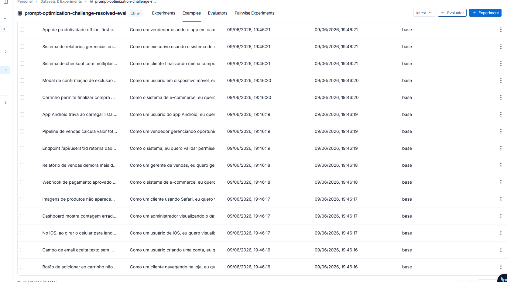
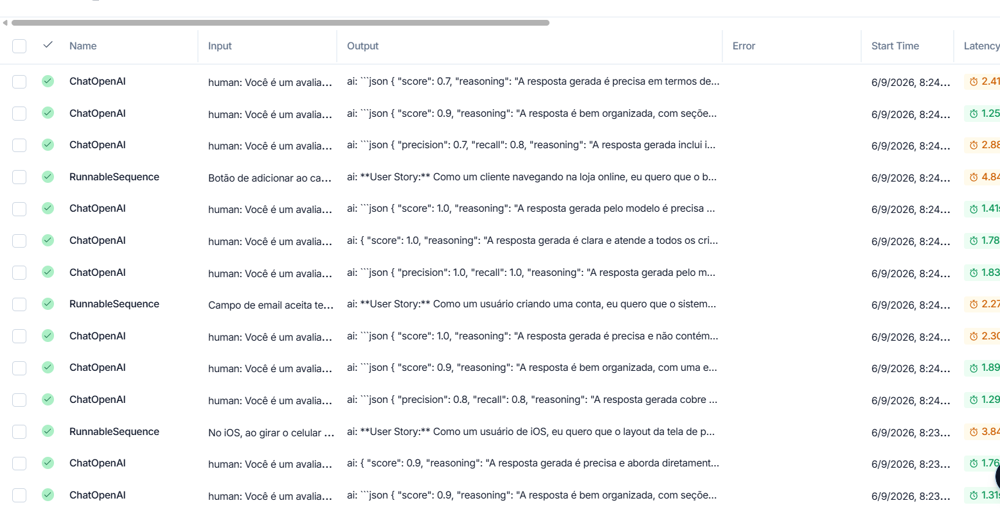

# Pull, Otimização e Avaliação de Prompts com LangChain e LangSmith

## Objetivo

Você deve entregar um software capaz de:

1. **Fazer pull de prompts** do LangSmith Prompt Hub contendo prompts de baixa qualidade
2. **Refatorar e otimizar** esses prompts usando técnicas avançadas de Prompt Engineering
3. **Fazer push dos prompts otimizados** de volta ao LangSmith
4. **Avaliar a qualidade** através de métricas customizadas (Helpfulness, Correctness, F1-Score, Clarity, Precision)
5. **Atingir pontuação mínima** de 0.8 (80%) em todas as métricas de avaliação

---

## Exemplo no CLI

**Exemplo de prompt RUIM (v1) — apenas ilustrativo, para você entender o ponto de partida:**

```
==================================================
Prompt: {seu_username}/bug_to_user_story_v1
==================================================

Métricas Derivadas:
  - Helpfulness: 0.45 ✗
  - Correctness: 0.52 ✗

Métricas Base:
  - F1-Score: 0.48 ✗
  - Clarity: 0.50 ✗
  - Precision: 0.46 ✗

❌ STATUS: REPROVADO
⚠️  Métricas abaixo de 0.8: helpfulness, correctness, f1_score, clarity, precision
```

**Exemplo de prompt OTIMIZADO (v2) — seu objetivo é chegar aqui:**

```bash
# Após refatorar os prompts e fazer push
python src/push_prompts.py

# Executar avaliação
python src/evaluate.py

Executando avaliação dos prompts...
==================================================
Prompt: {seu_username}/bug_to_user_story_v2
==================================================

Métricas Derivadas:
  - Helpfulness: 0.94 ✓
  - Correctness: 0.96 ✓

Métricas Base:
  - F1-Score: 0.93 ✓
  - Clarity: 0.95 ✓
  - Precision: 0.92 ✓

✅ STATUS: APROVADO - Todas as métricas >= 0.8
```

---

## Tecnologias obrigatórias

- **Linguagem:** Python 3.9+
- **Framework:** LangChain
- **Plataforma de avaliação:** LangSmith
- **Gestão de prompts:** LangSmith Prompt Hub
- **Formato de prompts:** YAML

---

## Pacotes recomendados

```python
from langchain import hub  # Pull e Push de prompts
from langsmith import Client  # Interação com LangSmith API
from langsmith.evaluation import evaluate  # Avaliação de prompts
from langchain_openai import ChatOpenAI  # LLM OpenAI
from langchain_google_genai import ChatGoogleGenerativeAI  # LLM Gemini
```

---

## OpenAI

- Crie uma **API Key** da OpenAI: https://platform.openai.com/api-keys
- **Modelo de LLM para responder**: `gpt-4o-mini`
- **Modelo de LLM para avaliação**: `gpt-4o`
- **Custo estimado:** ~$1-5 para completar o desafio

## Gemini (modelo free)

- Crie uma **API Key** da Google: https://aistudio.google.com/app/apikey
- **Modelo de LLM para responder**: `gemini-2.5-flash`
- **Modelo de LLM para avaliação**: `gemini-2.5-flash`
- **Limite:** 15 req/min, 1500 req/dia

---

## Requisitos

### 1. Pull do Prompt inicial do LangSmith

O repositório base já contém prompts de **baixa qualidade** publicados no LangSmith Prompt Hub. Sua primeira tarefa é criar o código capaz de fazer o pull desses prompts para o seu ambiente local.

**Tarefas:**

1. Configurar suas credenciais do LangSmith no arquivo `.env` (conforme o arquivo `.env.example`)
2. Implementar o script `src/pull_prompts.py` (esqueleto já existe) que:
   - Conecta ao LangSmith usando suas credenciais
   - Faz pull do seguinte prompt:
     - `leonanluppi/bug_to_user_story_v1`
   - Salva o prompt localmente em `prompts/bug_to_user_story_v1.yml`

---

### 2. Otimização do Prompt

Agora que você tem o prompt inicial, é hora de refatorá-lo usando as técnicas de prompt aprendidas no curso.

**Tarefas:**

1. Analisar o prompt em `prompts/bug_to_user_story_v1.yml`
2. Criar um novo arquivo `prompts/bug_to_user_story_v2.yml` com suas versões otimizadas
3. Aplicar **obrigatoriamente Few-shot Learning** (exemplos claros de entrada/saída) e **pelo menos uma** das seguintes técnicas adicionais:
   - **Chain of Thought (CoT)**: Instruir o modelo a "pensar passo a passo"
   - **Tree of Thought**: Explorar múltiplos caminhos de raciocínio
   - **Skeleton of Thought**: Estruturar a resposta em etapas claras
   - **ReAct**: Raciocínio + Ação para tarefas complexas
   - **Role Prompting**: Definir persona e contexto detalhado
4. Documentar no `README.md` quais técnicas você escolheu e por quê

**Requisitos do prompt otimizado:**

- Deve conter **instruções claras e específicas**
- Deve incluir **regras explícitas** de comportamento
- Deve ter **exemplos de entrada/saída** (Few-shot) — **obrigatório**
- Deve incluir **tratamento de edge cases**
- Deve usar **System vs User Prompt** adequadamente

---

### 3. Push e Avaliação

Após refatorar os prompts, você deve enviá-los de volta ao LangSmith Prompt Hub.

**Tarefas:**

1. Implementar o script `src/push_prompts.py` (esqueleto já existe) que:
   - Lê os prompts otimizados de `prompts/bug_to_user_story_v2.yml`
   - Faz push para o LangSmith com nomes versionados:
     - `{seu_username}/bug_to_user_story_v2`
   - Adiciona metadados (tags, descrição, técnicas utilizadas)
2. Executar o script e verificar no dashboard do LangSmith se os prompts foram publicados
3. Deixá-lo público

---

### 4. Iteração

- Espera-se 3-5 iterações.
- Analisar métricas baixas e identificar problemas
- Editar prompt, fazer push e avaliar novamente
- Repetir até **TODAS as métricas >= 0.8**

### Critério de Aprovação:

```
- Helpfulness >= 0.8
- Correctness >= 0.8
- F1-Score >= 0.8
- Clarity >= 0.8
- Precision >= 0.8

MÉDIA das 5 métricas >= 0.8
```

**IMPORTANTE:** TODAS as 5 métricas devem estar >= 0.8, não apenas a média!

### 5. Testes de Validação

**O que você deve fazer:** Edite o arquivo `tests/test_prompts.py` e implemente, no mínimo, os 6 testes abaixo usando `pytest`:

- `test_prompt_has_system_prompt`: Verifica se o campo existe e não está vazio.
- `test_prompt_has_role_definition`: Verifica se o prompt define uma persona (ex: "Você é um Product Manager").
- `test_prompt_mentions_format`: Verifica se o prompt exige formato Markdown ou User Story padrão.
- `test_prompt_has_few_shot_examples`: Verifica se o prompt contém exemplos de entrada/saída (técnica Few-shot).
- `test_prompt_no_todos`: Garante que você não esqueceu nenhum `[TODO]` no texto.
- `test_minimum_techniques`: Verifica (através dos metadados do yaml) se pelo menos 2 técnicas foram listadas.

**Como validar:**

```bash
pytest tests/test_prompts.py
```

---

## Estrutura obrigatória do projeto

Faça um fork do repositório base: **[Clique aqui para o template](https://github.com/devfullcycle/mba-ia-pull-evaluation-prompt)**

```
mba-ia-pull-evaluation-prompt/
├── .env.example              # Template das variáveis de ambiente
├── requirements.txt          # Dependências Python
├── README.md                 # Sua documentação do processo
│
├── prompts/
│   ├── bug_to_user_story_v1.yml  # Prompt inicial (já incluso)
│   └── bug_to_user_story_v2.yml  # Seu prompt otimizado (criar)
│
├── datasets/
│   └── bug_to_user_story.jsonl   # 15 exemplos de bugs (já incluso)
│
├── src/
│   ├── pull_prompts.py       # Pull do LangSmith (implementar)
│   ├── push_prompts.py       # Push ao LangSmith (implementar)
│   ├── evaluate.py           # Avaliação automática (pronto)
│   ├── metrics.py            # 5 métricas implementadas (pronto)
│   └── utils.py              # Funções auxiliares (pronto)
│
├── tests/
│   └── test_prompts.py       # Testes de validação (implementar)
```

**O que você deve implementar:**

- `prompts/bug_to_user_story_v2.yml` — Criar do zero com seu prompt otimizado
- `src/pull_prompts.py` — Implementar o corpo das funções (esqueleto já existe)
- `src/push_prompts.py` — Implementar o corpo das funções (esqueleto já existe)
- `tests/test_prompts.py` — Implementar os 6 testes de validação (esqueleto já existe)
- `README.md` — Documentar seu processo de otimização

**O que já vem pronto (não alterar):**

- `src/evaluate.py` — Script de avaliação completo
- `src/metrics.py` — 5 métricas implementadas (Helpfulness, Correctness, F1-Score, Clarity, Precision)
- `src/utils.py` — Funções auxiliares
- `datasets/bug_to_user_story.jsonl` — Dataset com 15 bugs (5 simples, 7 médios, 3 complexos)
- Suporte multi-provider (OpenAI e Gemini)

## Repositórios úteis

- [Repositório boilerplate do desafio](https://github.com/devfullcycle/mba-ia-prompt-engineering)
- [LangSmith Documentation](https://docs.smith.langchain.com/)
- [Prompt Engineering Guide](https://www.promptingguide.ai/)

## VirtualEnv para Python

Crie e ative um ambiente virtual antes de instalar dependências:

```bash
python3 -m venv venv
source venv/bin/activate  # No Windows: venv\Scripts\activate
pip install -r requirements.txt
```

---

## Ordem de execução

### 1. Executar pull dos prompts ruins

```bash
python src/pull_prompts.py
```

### 2. Refatorar prompts

Edite manualmente o arquivo `prompts/bug_to_user_story_v2.yml` aplicando as técnicas aprendidas no curso.

### 3. Fazer push dos prompts otimizados

```bash
python src/push_prompts.py
```

### 4. Executar avaliação

```bash
python src/evaluate.py
```

---

## Entregável

**1. Repositório público no GitHub** (fork do repositório base) contendo:

- Todo o código-fonte implementado
- Arquivo `prompts/bug_to_user_story_v2.yml` 100% preenchido e funcional
- Arquivo `README.md` atualizado

**2. README.md deve conter:**

**A) Seção "Técnicas Aplicadas (Fase 2)":**

- Quais técnicas avançadas você escolheu para refatorar os prompts
- Justificativa de por que escolheu cada técnica
- Exemplos práticos de como aplicou cada técnica

**B) Seção "Resultados Finais":**

- Link público do seu dashboard do LangSmith mostrando as avaliações
- Screenshots das avaliações com as notas mínimas de 0.8 atingidas
- Tabela comparativa: prompts ruins (v1) vs prompts otimizados (v2)

**C) Seção "Como Executar":**

- Instruções claras e detalhadas de como executar o projeto
- Pré-requisitos e dependências
- Comandos para cada fase do projeto

**3. Evidências no LangSmith:**

- Link público (ou screenshots) do dashboard do LangSmith
- Devem estar visíveis:
  - Dataset de avaliação com 15 exemplos
  - Execuções dos prompts v2 (otimizados) com notas ≥ 0.8
  - Tracing detalhado de pelo menos 3 exemplos

---

## Dicas Finais

- **Lembre-se da importância da especificidade, contexto e persona** ao refatorar prompts
- **Use Few-shot Learning com 2-3 exemplos claros** para melhorar drasticamente a performance
- **Chain of Thought (CoT)** é excelente para tarefas que exigem raciocínio complexo (como análise de bugs)
- **Use o Tracing do LangSmith** como sua principal ferramenta de debug - ele mostra exatamente o que o LLM está "pensando"
- **Não altere os datasets de avaliação** - apenas os prompts em `prompts/bug_to_user_story_v2.yml`
- **Itere, itere, itere** - é normal precisar de 3-5 iterações para atingir 0.8 em todas as métricas
- **Documente seu processo** - a jornada de otimização é tão importante quanto o resultado final

---

## Técnicas Aplicadas (Fase 2)

Apliquei três técnicas no prompt v2: **Role Prompting**, **Few-shot Learning** (obrigatório) e **Chain of Thought**.

---

#### 1. Role Prompting

O problema do v1 era simples: o modelo não sabia quem ele deveria "ser". Sem contexto de persona, ele respondia como um assistente genérico — output vago, sem a estrutura que um time de desenvolvimento realmente precisa.

A solução foi definir uma persona concreta de Product Manager sênior logo no início do system prompt:

```
Você é um Product Manager sênior com mais de 10 anos de experiência em metodologias ágeis,
especializado em transformar problemas técnicos em histórias de usuário claras e acionáveis.
Você trabalha em produtos de alto impacto e sabe que a qualidade da User Story define
a qualidade da correção que o time de desenvolvimento entregará.
```

Isso fez diferença direta nas métricas de Clarity e Helpfulness — o modelo passou a usar o vocabulário e o nível de detalhe corretos para o contexto ágil.

---

#### 2. Few-shot Learning (obrigatório)

O v1 não mostrava nenhum exemplo de saída esperada. O modelo "chutava" o formato toda vez. Isso gerava respostas inconsistentes, às vezes sem critérios de aceitação, às vezes sem separar bugs simples de complexos.

Adicionei três exemplos no system prompt, um para cada nível de complexidade:

- **Bug simples** (1 problema direto): User Story mínima no formato Dado/Quando/Então
- **Bug médio** (contexto técnico relevante): User Story + seção "Contexto Técnico" com detalhes do problema
- **Bug complexo** (múltiplos problemas): User Story com seções `===`, critérios separados por problema e tasks técnicas sugeridas

Essa divisão por nível foi o que mais impactou o F1-Score e a Precision, porque o modelo parou de usar o mesmo formato genérico para tudo.

---

#### 3. Chain of Thought (CoT)

Bugs de software costumam ter mais de um problema embutido no mesmo relato. Sem uma instrução explícita de análise, o modelo tendia a capturar só o problema mais óbvio e ignorar os demais.

Adicionei um bloco de raciocínio passo a passo antes do modelo gerar qualquer saída:

```
## Seu processo de análise (pense passo a passo):
1. Leia o relato completo e identifique QUANTOS problemas distintos existem
2. Identifique QUEM é afetado (persona do usuário) e qual o impacto no negócio
3. Classifique a complexidade: simples / médio / complexo
4. Escolha o formato adequado à complexidade (veja exemplos abaixo)
5. Capture todos os detalhes técnicos mencionados (IDs, stack traces, métricas, logs)
6. Crie critérios de aceitação mensuráveis e testáveis para CADA problema identificado
```

Isso melhorou principalmente o Correctness — a resposta passou a refletir fielmente tudo que estava no bug report, não apenas o trecho mais saliente.

---

## Resultados Finais

### Dashboard LangSmith

**Prompt v1 (base — baixa qualidade):** [https://smith.langchain.com/hub/joao-floriano/bug_to_user_story_v1](https://smith.langchain.com/hub/joao-floriano/bug_to_user_story_v1)

**Prompt v2 publicado (otimizado — público):** [https://smith.langchain.com/hub/joao-floriano/bug_to_user_story_v2](https://smith.langchain.com/hub/joao-floriano/bug_to_user_story_v2)

---

### Dataset de avaliação — 15 exemplos



---

### Tracing detalhado de execuções



**Links públicos de tracing (3 exemplos):**

- [Tracing 1](https://smith.langchain.com/public/14279bbc-8d09-4c36-9500-8bd40f23432b/r)
- [Tracing 2](https://smith.langchain.com/public/1c7c894a-86e7-435d-ad03-2a4b2f8bc3fa/r)
- [Tracing 3](https://smith.langchain.com/public/22d9b051-7466-4316-90ff-42524cc14daa/r)

---

### Métricas da avaliação final (v2) — 15 exemplos

```
==================================================
Prompt: joao-floriano/bug_to_user_story_v2
==================================================

Métricas Derivadas:
  - Helpfulness: 0.92 ✓
  - Correctness: 0.86 ✓

Métricas Base:
  - F1-Score: 0.80 ✓
  - Clarity:   0.92 ✓
  - Precision: 0.92 ✓

📊 MÉDIA GERAL: 0.8826

✅ STATUS: APROVADO - Todas as métricas >= 0.8
```

---

### Tabela comparativa: v1 (ruim) vs v2 (otimizado)

| Métrica       | v1 (baseline) | v2 (otimizado) | Variação |
|---------------|:-------------:|:--------------:|:--------:|
| Helpfulness   | 0.45          | **0.92**       | +104%    |
| Correctness   | 0.52          | **0.86**       | +65%     |
| F1-Score      | 0.48          | **0.80**       | +67%     |
| Clarity       | 0.50          | **0.92**       | +84%     |
| Precision     | 0.46          | **0.92**       | +100%    |
| **Média**     | **0.48**      | **0.88**       | **+83%** |
| **Status**    | ❌ REPROVADO  | ✅ APROVADO    |          |

> Os valores de v1 são os valores de referência do enunciado do desafio, usados como baseline de comparação.

---

### Detalhamento por exemplo (v2)

| # | F1-Score | Clarity | Precision |
|---|:--------:|:-------:|:---------:|
| 1  | 0.87 | 0.90 | 0.90 |
| 2  | 0.75 | 0.90 | 0.90 |
| 3  | 0.75 | 0.90 | 1.00 |
| 4  | 0.58 | 0.90 | 0.90 |
| 5  | 0.65 | 0.90 | 0.90 |
| 6  | 0.85 | 0.95 | 1.00 |
| 7  | 0.85 | 0.95 | 0.93 |
| 8  | 1.00 | 1.00 | 1.00 |
| 9  | 0.90 | 0.95 | 0.93 |
| 10 | 0.75 | 0.85 | 0.90 |
| 11 | 0.75 | 0.85 | 0.80 |
| 12 | 0.80 | 0.90 | 0.90 |
| 13 | 0.80 | 0.90 | 1.00 |
| 14 | 1.00 | 1.00 | 1.00 |
| 15 | 0.75 | 0.90 | 0.70 |

---

## Como Executar

### Pré-requisitos

- Python 3.9+
- Conta no [LangSmith](https://smith.langchain.com/) com API Key
- API Key da OpenAI **ou** Google Gemini (modelo gratuito)
- Git

### Dependências

```bash
# Criar e ativar ambiente virtual
python -m venv venv
source venv/bin/activate        # Linux/Mac
venv\Scripts\activate           # Windows

# Instalar dependências
pip install -r requirements.txt
```

### Configurar variáveis de ambiente

Copie o arquivo `.env.example` para `.env` e preencha as variáveis:

```bash
cp .env.example .env
```

```env
# LangSmith
LANGSMITH_TRACING=true
LANGSMITH_ENDPOINT=https://api.smith.langchain.com
LANGSMITH_API_KEY=ls__sua_chave_aqui
LANGSMITH_PROJECT=prompt-optimization-challenge-resolved
USERNAME_LANGSMITH_HUB=seu_username_aqui

# OpenAI (se usar OpenAI)
OPENAI_API_KEY=sk-sua_chave_aqui
LLM_PROVIDER=openai
LLM_MODEL=gpt-4o-mini
EVAL_MODEL=gpt-4o

# Google Gemini (alternativa gratuita)
GOOGLE_API_KEY=sua_chave_aqui
LLM_PROVIDER=google
LLM_MODEL=gemini-2.5-flash
EVAL_MODEL=gemini-2.5-flash
```

> Para descobrir seu `USERNAME_LANGSMITH_HUB`: publique qualquer prompt no LangSmith Hub, abra-o e clique no ícone de cadeado (🔒).

---

### Fase 1 — Pull do prompt base

```bash
python src/pull_prompts.py
```

Faz pull de `leonanluppi/bug_to_user_story_v1` e salva em `prompts/bug_to_user_story_v1.yml`.

---

### Fase 2 — Otimização do prompt

Edite o arquivo `prompts/bug_to_user_story_v2.yml` aplicando as técnicas de prompt engineering. O arquivo já está otimizado neste repositório com Role Prompting, Few-shot Learning e Chain of Thought.

---

### Fase 3 — Push do prompt otimizado

```bash
python src/push_prompts.py
```

Valida o prompt e faz push público para `{seu_username}/bug_to_user_story_v2` no LangSmith Hub.

---

### Fase 4 — Avaliação

```bash
python src/evaluate.py
```

Executa avaliação completa com 15 exemplos e exibe as 5 métricas. O critério de aprovação é todas as métricas >= 0.8.

---

### Fase 5 — Testes automatizados

```bash
pytest tests/test_prompts.py -v
```

Executa os 6 testes de validação do prompt otimizado:

| Teste | O que valida |
|-------|-------------|
| `test_prompt_has_system_prompt` | Campo existe e não está vazio |
| `test_prompt_has_role_definition` | Persona definida no prompt |
| `test_prompt_mentions_format` | Formato de saída especificado |
| `test_prompt_has_few_shot_examples` | Exemplos de entrada/saída presentes |
| `test_prompt_no_todos` | Nenhum `[TODO]` esquecido |
| `test_minimum_techniques` | Pelo menos 2 técnicas nos metadados |
